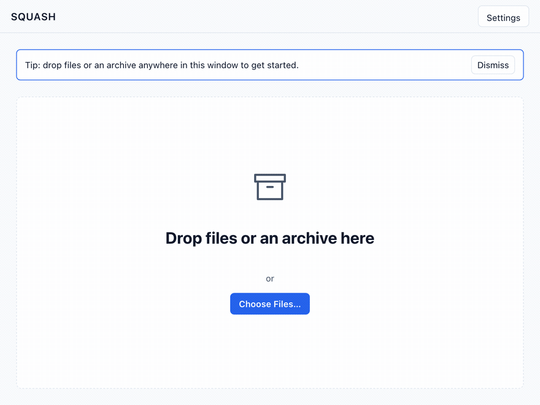
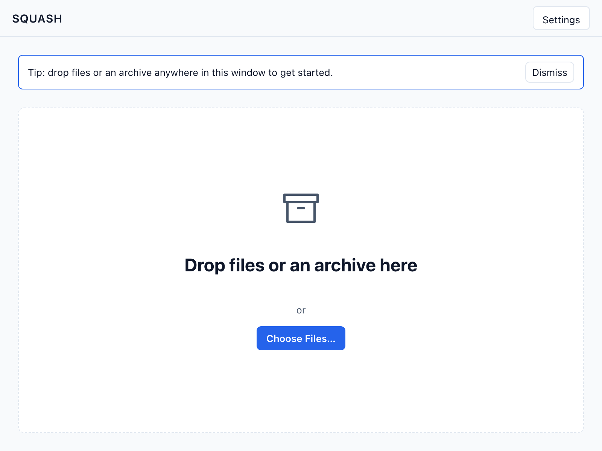
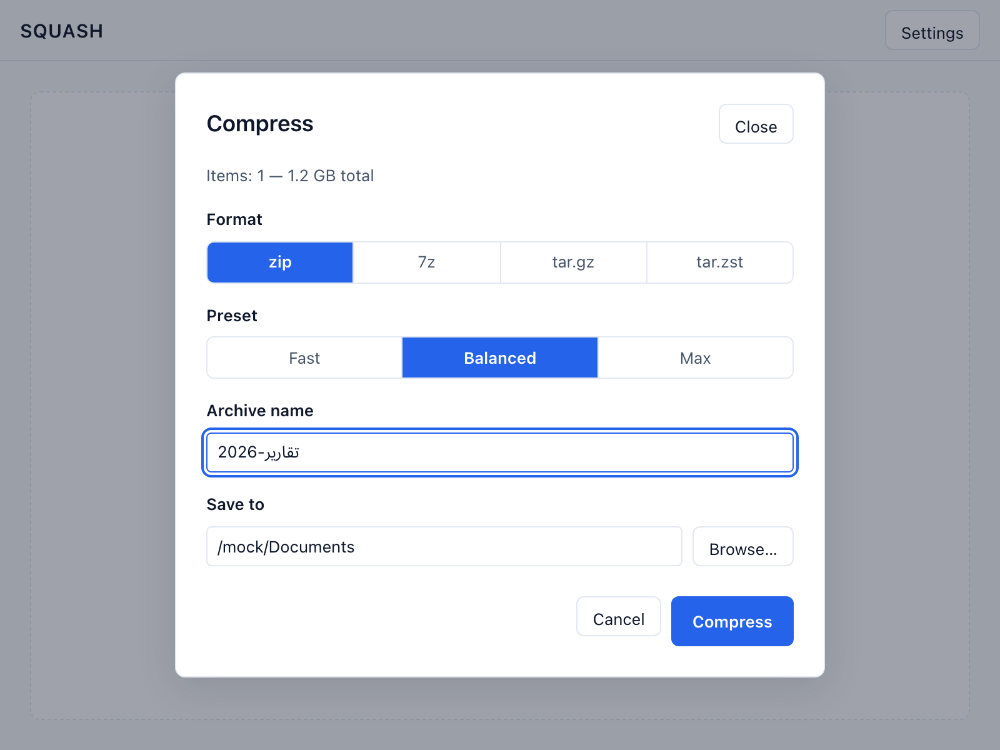
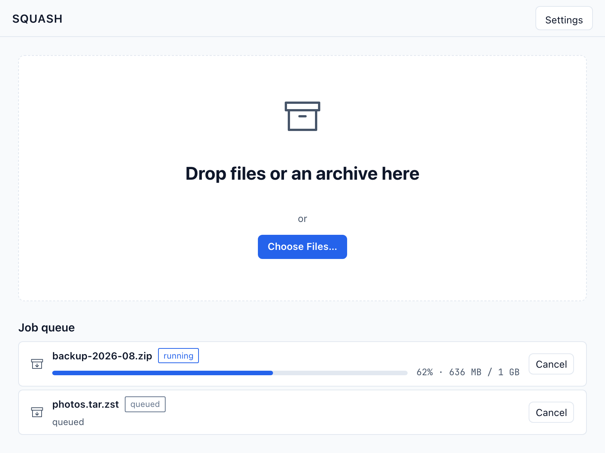
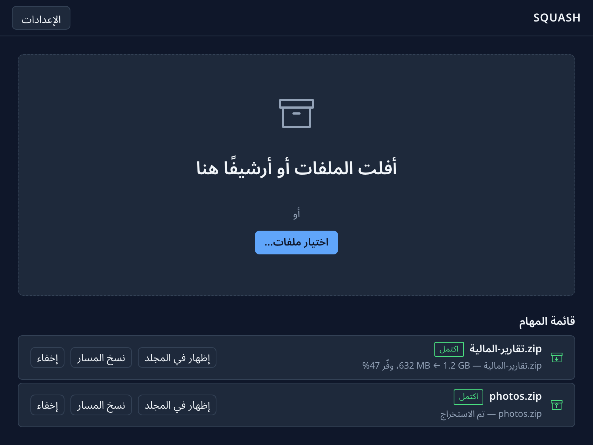

# Squash

[](https://github.com/qtrcipher/squash/actions/workflows/ci.yml)
[](LICENSE-MIT)

**Open-source file compressor for Windows and Linux — desktop GUI + CLI on one shared core.**

Squash is a free, open-source file archiver built as a modern 7-Zip alternative: one compression core behind both a native-feeling GUI and a scriptable CLI, identical on Windows and Linux. It opens RAR, 7z, zip, tar.gz, tar.zst and more out of the box — so opening a RAR someone sent you or creating a tar.gz on Windows stops being a research project — and it compresses with modern codecs like zstd alongside the classic formats. No ads, no trial nag, no silent telemetry.

> Status: **v1.0.0 released** (2026-08-15) — Windows + Linux, GUI + CLI. See [Install](#install).

## Screenshots



<small>The demo is assembled from real renders of the actual app (the same snapshot-harness frames below), not staged footage.</small>

| | |
|---|---|
|  |  |
|  |  |

## Why Squash

Squash aims to beat the common compressors where they actually hurt: dated UIs, nagware, platform lock-in, and weak automation — not by chasing another fraction of compression ratio.

- **One app, every supported desktop OS** — same UI, same CLI, same behavior on Windows and Linux.
- **Modern formats, first-class** — zstd (`.tar.zst` / `.zst`) alongside zip, 7z, and tar.gz; brotli is on the roadmap.
- **GUI for humans, CLI for scripts** — drag-and-drop and batch queues in the app; deterministic exit codes and `--json` in the terminal.
- **Trustworthy by construction** — open source, zip-slip and decompression-bomb protection on by default, no ads, no nagware, no silent telemetry (crash reporting is opt-in only — off unless you turn it on; see `docs/06-data-model.md` §6).
- **Bilingual from day one** — English and Arabic UI with full RTL layout, light and dark themes.

## How it compares

Competitor facts are sourced in [docs/02-market-check.md](docs/02-market-check.md) (surveyed Aug 2026). `—` means the survey didn't cover it.

| | **Squash** | 7-Zip | WinRAR | Keka | PeaZip |
|---|---|---|---|---|---|
| Open source | ✅ MIT/Apache-2.0 | ✅ LGPL | ❌ trialware | ✅ (paid on App Store) | ✅ LGPLv3 |
| Same GUI on Windows + Linux | ✅ | ❌ Windows-only GUI | ❌ GUI is Windows-only | ❌ macOS-only | ✅ (cluttered UI) |
| CLI for scripting | ✅ `--json`, stable exit codes | ✅ | ✅ (Linux/macOS CLI) | ❌ | ✅ |
| zstd support | ✅ tar.zst / .zst | ✅ since 24.01 | ❌ | ✅ | ✅ |
| RAR extraction | ✅ (never creates RAR) | ✅ | ✅ | ✅ | ✅ |
| No ads / no nagware | ✅ | ✅ | ❌ 40-day-trial nags | ✅ | ✅ |
| Arabic UI + full RTL | ✅ EN+AR, both themes | — | — | — | — |
| Auto-updates | ✅ opt-in (stable/beta) | ❌ none | — | — | — |

## Formats

- **Compress:** zip, 7z, tar.gz, tar.zst, and single-file gz / xz / zst — three presets (fast / balanced / max), no per-codec flag jungle.
- **Extract:** everything above plus tar, tar.bz2, tar.xz, and rar.

## Benchmarks

Measured 2026-08-14 on an Apple M3 Max (16 cores, 48 GB RAM, macOS arm64) with the seeded benchmark corpus (seed 42, 25.2 MB across text / binary / mixed / compressed / small-files sets; text set shown, 10.07 MB input, median of 3 repetitions). `squash` rows are Squash's own engine; gzip / zstd / xz rows are the system tools. Full data: [benches/baseline.json](benches/baseline.json).

| Command | Output | Compress time |
|---|---|---|
| `gzip -1` | 1.77 MB | 33 ms |
| **`squash c` tar.zst · fast (zstd 3)** | 1.48 MB | **17 ms** |
| `gzip -6` | 1.48 MB | 78 ms |
| **`squash c` tar.zst · balanced (zstd 7)** | **1.34 MB** | **57 ms** |
| `xz -6` | 1.11 MB | 1,771 ms |
| **`squash c` 7z · balanced (level 5)** | 1.22 MB | 1,077 ms |
| **`squash c` 7z · max (level 9)** | 1.15 MB | 1,889 ms |
| **`squash c` tar.zst · max (zstd 19)** | 1.14 MB | 2,294 ms |

At roughly the same output size as `gzip -6`, Squash's zstd fast preset ran **4.6× faster**; balanced zstd was both smaller (1.34 vs 1.48 MB) and faster (57 vs 78 ms). xz still wins raw ratio — at ~31× the compress time. A head-to-head 7-Zip (`7zz`) column is pending p7zip in the CI benchmark job; the 7z rows above use the same LZMA2 family, so they are indicative, not a final verdict.

## Install

**[Download v1.0.0](https://github.com/qtrcipher/squash/releases/latest)** — Windows GUI installer (`setup.exe` / `.msi`), Linux `.deb` / `.rpm` / `.AppImage`, and standalone CLI archives. Verify against `SHA256SUMS.txt`. Builds are unsigned for now — expect a one-time SmartScreen prompt on Windows.

Coming soon (manifests update manually for now): `brew install qtrcipher/tap/squash` (Linux CLI) · `winget install qtrcipher.Squash` · `scoop bucket add squash https://github.com/qtrcipher/scoop-bucket && scoop install squash`
- **Linux (GUI)** — download the `.deb` / `.rpm` / `.AppImage` from [Releases](https://github.com/qtrcipher/squash/releases) and install with your package manager (`sudo dpkg -i squash_*.deb`, `sudo dnf install squash-*.rpm`); Flatpak via Flathub is planned.
- **Arch Linux** — `yay -S squash` (AUR, planned after the first release)

Every release will publish `SHA256SUMS.txt` (GPG-signed once configured) so you can verify downloads.

## Project layout

```
crates/squash-core   # compression engine: jobs, formats, presets (Rust)
crates/squash-cli    # command-line interface
crates/squash-bench  # benchmark harness (vs 7-Zip & co.)
app/                 # desktop GUI (Tauri v2 + React/TypeScript)
docs/                # planning: product, market, UX, design, architecture, data model, security audit
packaging/           # package-manager templates + publish scripts (Homebrew, Scoop, winget, Flatpak, AUR)
```

## Documentation

| Doc | Contents |
|---|---|
| [docs/01-product-scope.md](docs/01-product-scope.md) | Problem, users, MVP scope, success metrics |
| [docs/02-market-check.md](docs/02-market-check.md) | Competitor landscape, complaints, gaps |
| [docs/03-ux-flows.md](docs/03-ux-flows.md) | Screens, flows, UI states |
| [docs/04-design-direction.md](docs/04-design-direction.md) | Style, palette, typography, tokens |
| [docs/05-architecture.md](docs/05-architecture.md) | Stack, modules, format strategy |
| [docs/06-data-model.md](docs/06-data-model.md) | Local settings, presets, history |
| [docs/07-security-audit.md](docs/07-security-audit.md) | Zip-slip / bomb / unrar-boundary audit |

Progress is tracked in [PROGRESS.md](PROGRESS.md), changes in [CHANGELOG.md](CHANGELOG.md); house rules for contributors (human or AI) in [AGENTS.md](AGENTS.md).

## Building

See [CONTRIBUTING.md](CONTRIBUTING.md).

## License

Dual-licensed under [MIT](LICENSE-MIT) or [Apache-2.0](LICENSE-APACHE), at your option.

RAR note: Squash **extracts** RAR archives (via RARLAB's unrar source, license-compatible) but will never **create** them — the RAR compression algorithm is proprietary. Use 7z or tar.zst instead; they're better anyway.
